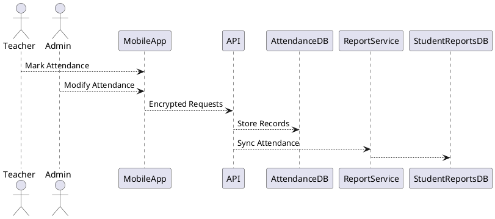
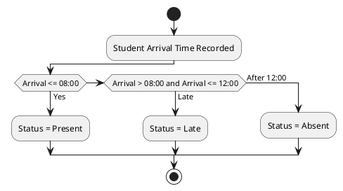

# E-SBA (Electronic School Based Assessment)

E-SBA is a comprehensive assessment management system designed for Junior High Schools. This repository contains the full source code for the React frontend and Express/Node.js backend.

## 1. Configuration Overview

The application is configured using a combination of **Environment Variables** (for server-side credentials and infrastructure) and **Runtime Configuration** (for school-specific settings stored in the browser).

### Environment Variables

Create a `.env` file in the project root. The application supports `.env`, `.env.development`, and `.env.local`.

#### Core Server

| Variable       | Default | Description                                                      |
| -------------- | ------- | ---------------------------------------------------------------- |
| `PORT`         | `3001`  | Port for the backend API server.                                 |
| `SCAN_ENABLED` | `0`     | Set to `1` to enable specific scanning features (if applicable). |
| `SCHOOL_NAME`  | `E-SBA` | Default school name used in generated Excel templates.           |

#### Database (MySQL)

The application connects to a MySQL database for the master record storage.

| Variable  | Default         | Description                                                  |
| --------- | --------------- | ------------------------------------------------------------ |
| `DB_HOST` | `localhost`     | Database hostname. Aliases: `MYSQL_HOST`, `DATABASE_HOST`.   |
| `DB_USER` | `esba_app_user` | Database username. Aliases: `MYSQL_USER`, `DATABASE_USER`.   |
| `DB_PASS` | `""` (Empty)    | Database password. Aliases: `DB_PASSWORD`, `MYSQL_PASSWORD`. |
| `DB_NAME` | `esba_jhs_db`   | Database name. Aliases: `MYSQL_DATABASE`, `DATABASE_NAME`.   |

#### Security & Tokens

These tokens secure sensitive API endpoints.

| Variable         | Required | Description                                              |
| ---------------- | -------- | -------------------------------------------------------- |
| `UPLOAD_TOKEN`   | **Yes**  | Required header token for uploading files to the server. |
| `DOWNLOAD_TOKEN` | **Yes**  | Required header token for downloading secure content.    |

#### Cloud Storage (Vercel Blob)

Used for storing larger binary assets if configured.

| Variable                | Required | Description                                                   |
| ----------------------- | -------- | ------------------------------------------------------------- |
| `BLOB_READ_WRITE_TOKEN` | Optional | Token for Vercel Blob storage. Alias: `VERCEL_BLOB_RW_TOKEN`. |

#### Supabase (PostgreSQL)

Optional integration for alternative storage or specific features.

| Variable                    | Required | Description                                                     |
| --------------------------- | -------- | --------------------------------------------------------------- |
| `SUPABASE_URL`              | Optional | URL for the Supabase instance.                                  |
| `SUPABASE_SERVICE_ROLE_KEY` | Optional | Service role key for admin access.                              |
| `SUPABASE_PG_CONN`          | Optional | Connection string for Supabase Postgres. Alias: `POSTGRES_URL`. |

---

## 2. Setup Instructions

### Prerequisites

- **Node.js**: v18.0.0 or higher.
- **MySQL**: v8.0 or higher (or MariaDB equivalent).
- **Package Manager**: `npm` (included with Node.js).

### Step-by-Step Configuration

1.  **Clone the Repository**

    ```bash
    git clone <repository-url>
    cd e-SBA
    ```

2.  **Install Dependencies**

    ```bash
    npm install
    ```

3.  **Environment Setup**
    Create a `.env` file in the root directory and configure your database credentials and security tokens.

    > **Security Note:** Never commit your `.env` file to version control.

    ```env
    PORT=3001

    # Database Configuration
    DB_HOST=localhost
    DB_USER=your_db_username      # Replace with your local DB user
    DB_PASS=your_db_password      # Replace with your local DB password
    DB_NAME=esba_jhs_db

    # Security Tokens (Generate strong random strings)
    UPLOAD_TOKEN=your_secure_upload_token_here
    DOWNLOAD_TOKEN=your_secure_download_token_here
    ```

4.  **Database Initialization**
    Initialize the local MySQL database with the schema:

    ```bash
    # Resets the database and applies the schema (WARNING: Deletes existing data)
    npm run db:reset
    ```

    Alternatively, use `npm run db:clean` to clear data without dropping tables.

5.  **Start the Application**

    - **Development Mode** (Hot-reload enabled for both frontend and backend):

      ```bash
      # Terminal 1: Frontend (Vite)
      npm run dev

      # Terminal 2: Backend (Express)
      npm run server:dev
      ```

    - **Production Build**:
      ```bash
      npm run build        # Build frontend
      npm run server:build # Build backend
      npm run server:start # Start production server
      ```

---

## 3. Runtime Configuration

Unlike infrastructure settings, **School Configuration** is managed directly within the application UI and persists in the browser's local storage (IndexedDB).

### Dynamic Options

Navigate to the **Settings** or **Profile** section in the application to configure:

- **School Details**: Name, Motto, Address, Head Teacher's name.
- **Assessment Weights**: Class Assessment (Default: 50%) vs. Exam Weight (Default: 50%).
- **Assets**: School Logo and Head Teacher's Signature.
- **Grading System**: Define grade ranges (e.g., 80-100 = Grade 1) and remarks.

### Hot-Reload Capabilities

- **Frontend**: Vite provides Hot Module Replacement (HMR). Changes to React components (`src/`) reflect instantly without a full page reload.
- **Backend**: `tsx` watches for file changes in `server/` and automatically restarts the API server during development.

### Validation

- **Templates**: Generated Excel templates utilize data validation to restrict input types (e.g., numeric scores).
- **Parsing**: The system validates uploaded assessment sheets against the expected schema (Student ID, columns for Task 1-4, etc.).

---

## 4. Security Considerations

### Sensitive Parameters

- **Tokens**: `UPLOAD_TOKEN` and `DOWNLOAD_TOKEN` effectively act as API keys. **Do not** share these or commit them to version control.
- **Database Credentials**: Ensure `DB_PASS` is strong and the database user has only necessary privileges.

### Recommended Practices

1.  **GitIgnore**: Ensure `.env` and `*.local` files are listed in `.gitignore` to prevent accidental commits.
2.  **Token Rotation**: Periodically rotate `UPLOAD_TOKEN` and `DOWNLOAD_TOKEN` in production environments.
3.  **Encryption**: The application includes utilities (`lib/storage.ts`) that support encrypted storage for local data using `crypto.subtle`. When implementing new storage features, enable the `encrypt` flag for sensitive user data.

### Troubleshooting

- **Database Connection Failed**: Verify `DB_HOST` and credentials in `.env`. Ensure the MySQL service is running.
- **Uploads Failing**: Check that the client requests include the `x-upload-token` header matching the `UPLOAD_TOKEN` env var.
- **Version Mismatch**: If you encounter errors related to `Task1-4` vs `cat1-4`, ensure you are using the latest Excel templates generated by the system, as column mappings have been updated.

---

## 5. Version History

- **v1.1.0** (2026-01-13): Documentation update — integrated SPEC-1 Digital Classroom Register System into README (architecture, requirements, schema, and security).
- **v1.0.0**: Initial release with comprehensive assessment management, Excel template generation, and student reporting features.

---

## 6. Contribution Guidelines

We welcome contributions to the E-SBA project!

1.  **Fork the Repository**: Create your own copy of the project.
2.  **Create a Branch**: Use a descriptive name (e.g., `feature/new-grading-system` or `fix/upload-bug`).
3.  **Commit Changes**: Ensure your code is clean and well-documented. Sanitize any personal data or secrets from your commits.
4.  **Push to Branch**: Upload your changes to your fork.
5.  **Submit a Pull Request**: Describe your changes and reference any related issues.

Please ensure all tests pass (`npm test`) before submitting.

---

## 7. Author & Contact

**Mr. Felix Akabati**  
Email: [felixakabati007@gmail.com](mailto:felixakabati007@gmail.com)

---

## 8. License & Copyright

**Copyright © 2023 E-SBA. All Rights Reserved.**

This project is licensed under the **MIT License**.

Permission is hereby granted, free of charge, to any person obtaining a copy of this software and associated documentation files (the "Software"), to deal in the Software without restriction, including without limitation the rights to use, copy, modify, merge, publish, distribute, sublicense, and/or sell copies of the Software, and to permit persons to whom the Software is furnished to do so, subject to the following conditions:

The above copyright notice and this permission notice shall be included in all copies or substantial portions of the Software.

---

## 9. Digital Classroom Register System (SPEC-1)

### Background

Ejisu M/A Model JHS requires a secure and auditable Digital Classroom Register system as part of its Electronic School-Based Assessment (e-SBA) initiative. Manual attendance tracking has resulted in data inconsistencies, delayed reporting, and limited oversight. This system aims to digitize daily attendance recording, ensure seamless integration with student reports, and enforce accountability through audit trails and role-based controls.

The register will operate on a **per-school-day basis**, automatically synchronizing validated attendance data into each student’s official academic report under the **ATTENDANCE** section.

---

### Requirements

#### Must Have

- Daily attendance tracking per student (per school day)
- Automatic synchronization of attendance data to the already existing student reports in real time
- Secure authentication for teachers and administrators
- Attendance status codes: Present, Late, Absent, Excused Absent
- Late-arrival rule enforcement:
  - School hours: **8:00 AM – 3:00 PM**
  - Arrival **after 12:00 PM** → marked **Absent by default**
- Edit permissions restricted to **Class Teachers and Head of Institution (Admin)**
- Full audit trail for all attendance changes
- Encrypted API communication
- Compliance with Ejisu Municipal Education data protection policies

#### Should Have

- ID-based student identification
- iPhone biometric verification using **LocalAuthentication (Touch ID / Face ID)** for Class Teacher authentication
- Offline attendance capture with conflict resolution
- Automatic daily encrypted backups
- Absence pattern detection (late arrivals and repeated absences)

#### Could Have

- Configurable attendance thresholds per term
- Exportable reports (PDF/CSV)

#### Won’t Have (MVP)

- Student self-check-in
- Facial recognition of students

---

### Method

#### Architecture Overview

- **Client Apps**: iOS (Teachers/Admin)
- **Backend**: RESTful API
- **Database**: Relational (PostgreSQL)
- **Auth**: Role-Based Access Control (RBAC)
- **Sync Mode**: Real-time with offline fallback



---

### Attendance Logic Algorithm (Daily)



- Records marked **Absent after 12:00 PM** may be modified **only** by Class Teacher or Admin with justification.

---

### Database Schema (Core Tables)

**students**

- student_id (PK)
- full_name
- class_id

**attendance_records**

- attendance_id (PK)
- student_id (FK)
- date
- status
- arrival_time
- recorded_by
- last_modified_at

**attendance_audit_logs**

- audit_id (PK)
- attendance_id (FK)
- modified_by
- old_value
- new_value
- reason
- timestamp

**users**

- user_id (PK)
- role (Class Teacher | Admin)
- biometric_enabled (boolean)

---

### Security & Sync

- HTTPS + TLS encryption
- JWT-based authentication
- iOS **LocalAuthentication framework** for staff biometric verification
- Real-time API sync; offline records queued and reconciled by timestamp priority
- Daily encrypted backups (AES-256)

---

### Implementation

1. Finalize attendance rules and codes with Ejisu M/A Model JHS
2. Build REST API with RBAC enforcement
3. Implement iOS app with LocalAuthentication integration
4. Develop attendance-report sync service
5. Implement audit logging and backup jobs
6. Conduct security and compliance testing

---

### Milestones

- Week 1–2: Requirements validation & schema design
- Week 3–4: Backend API & database implementation
- Week 5: iOS attendance module
- Week 6: Reporting integration
- Week 7: Security, audit, and backup validation
- Week 8: Pilot deployment

---

### Gathering Results

- Verify 100% synchronization accuracy between register and reports
- Audit trail completeness validation
- Attendance anomaly detection accuracy
- Staff usability feedback
- Compliance review with Ejisu Municipal Education

---

### Android Fingerprint Parity

Do the same for Android fingerprint using the LocalAuthentication.
