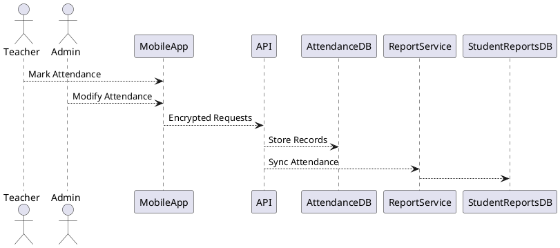
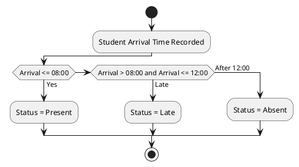

# SPEC-1-Digital Classroom Register System

## Background

Ejisu M/A Model JHS requires a secure and auditable Digital Classroom Register system as part of its Electronic School-Based Assessment (e-SBA) initiative. Manual attendance tracking has resulted in data inconsistencies, delayed reporting, and limited oversight. This system aims to digitize daily attendance recording, ensure seamless integration with student reports, and enforce accountability through audit trails and role-based controls.

The register will operate on a **per-school-day basis**, automatically synchronizing validated attendance data into each student’s official academic report under the **ATTENDANCE** section.

---

## Requirements

### Must Have

- Daily attendance tracking per student (per school day)
- Automatic synchronization of attendance data to the already existing student reports in real time
- Secure authentication for teachers and administrators
- Attendance status codes: Present, Late, Absent, Excused Absent
- Late-arrival rule enforcement:
  - School hours: **8:00 AM – 3:00 PM**
  - Arrival **after 12:00 PM** → marked **Absent by default**
- Edit permissions restricted to **Class Teachers and Head of Institution (Admin)**
- Full audit trail for all attendance changes
- Encrypted API communication
- Compliance with Ejisu Municipal Education data protection policies

### Should Have

- ID-based student identification
- iPhone biometric verification using **LocalAuthentication (Touch ID / Face ID)** for Class Teacher authentication
- Offline attendance capture with conflict resolution
- Automatic daily encrypted backups
- Absence pattern detection (late arrivals and repeated absences)

### Could Have

- Configurable attendance thresholds per term
- Exportable reports (PDF/CSV)

### Won’t Have (MVP)

- Student self-check-in
- Facial recognition of students

---

## Method

### Architecture Overview

- **Client Apps**: iOS (Teachers/Admin)
- **Backend**: RESTful API
- **Database**: Relational (PostgreSQL)
- **Auth**: Role-Based Access Control (RBAC)
- **Sync Mode**: Real-time with offline fallback

---

### Attendance Logic Algorithm (Daily)

- Records marked **Absent after 12:00 PM** may be modified **only** by Class Teacher or Admin with justification.

---

### Database Schema (Core Tables)

**students**

- student_id (PK)
- full_name
- class_id

**attendance_records**

- attendance_id (PK)
- student_id (FK)
- date
- status
- arrival_time
- recorded_by
- last_modified_at

**attendance_audit_logs**

- audit_id (PK)
- attendance_id (FK)
- modified_by
- old_value
- new_value
- reason
- timestamp

**users**

- user_id (PK)
- role (Class Teacher | Admin)
- biometric_enabled (boolean)

---

### Security & Sync

- HTTPS + TLS encryption
- JWT-based authentication
- iOS **LocalAuthentication framework** for staff biometric verification
- Real-time API sync; offline records queued and reconciled by timestamp priority
- Daily encrypted backups (AES-256)

---

## Implementation

1. Finalize attendance rules and codes with Ejisu M/A Model JHS
2. Build REST API with RBAC enforcement
3. Implement iOS app with LocalAuthentication integration
4. Develop attendance-report sync service
5. Implement audit logging and backup jobs
6. Conduct security and compliance testing

---

## Milestones

- Week 1–2: Requirements validation & schema design
- Week 3–4: Backend API & database implementation
- Week 5: iOS attendance module
- Week 6: Reporting integration
- Week 7: Security, audit, and backup validation
- Week 8: Pilot deployment

---

## Gathering Results

- Verify 100% synchronization accuracy between register and reports
- Audit trail completeness validation
- Attendance anomaly detection accuracy
- Staff usability feedback
- Compliance review with Ejisu Municipal Education

---

Do the same for Android finger print using the LocalAuthentication
